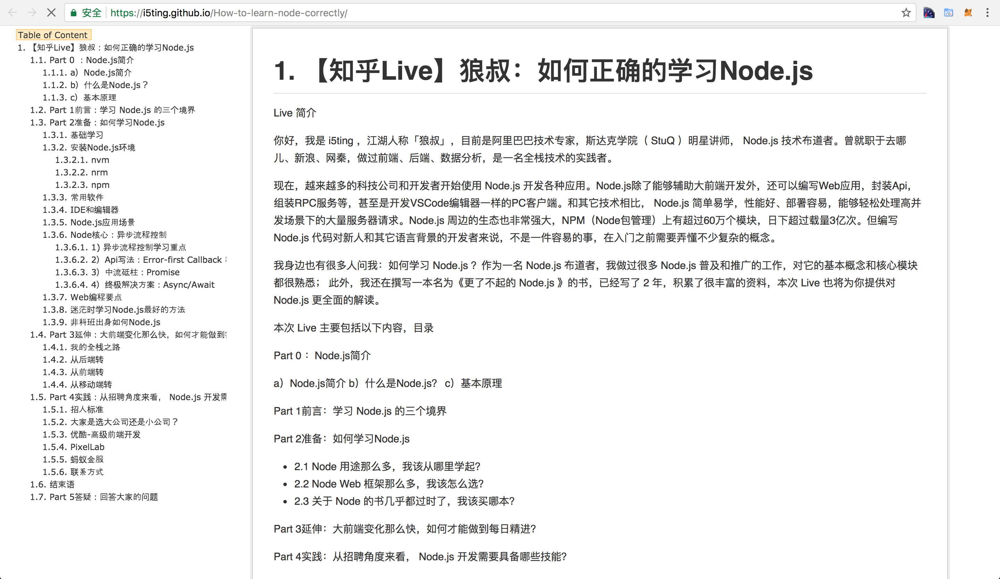
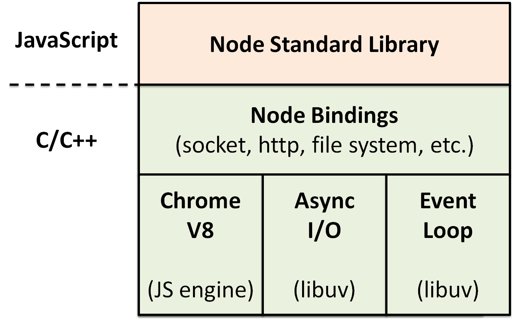
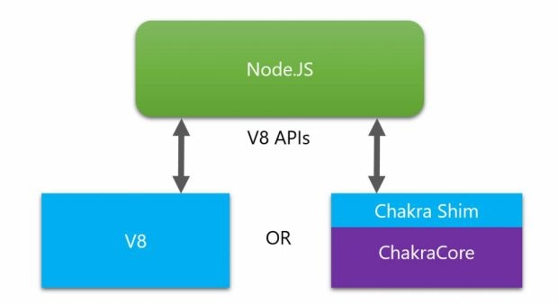
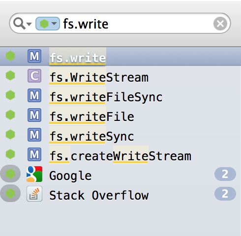
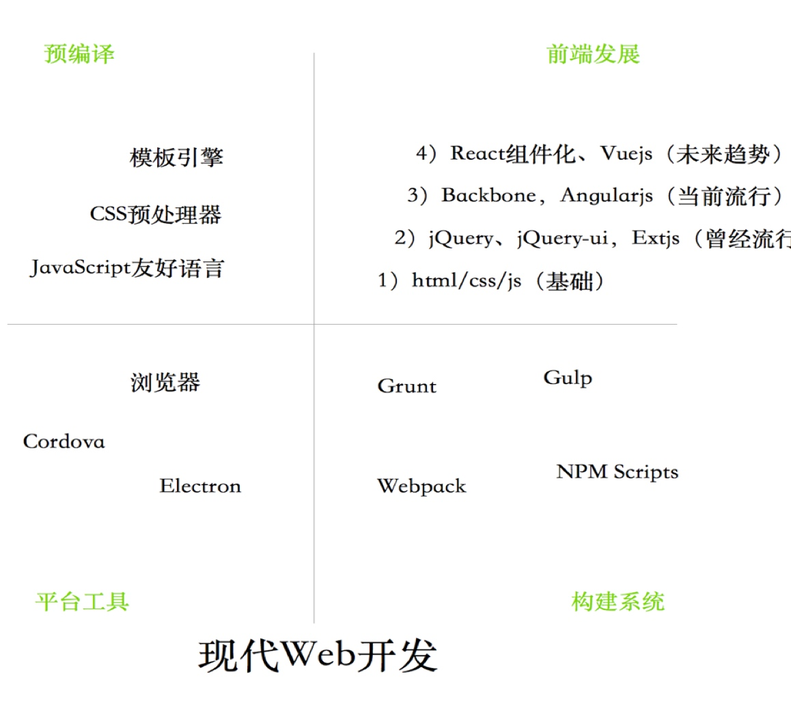

# 【知乎Live】狼叔：如何正确的学习Node.js



预览地址 https://i5ting.github.io/How-to-learn-node-correctly/

Live 简介

你好，我是 i5ting ，江湖人称「狼叔」，目前是阿里巴巴技术专家，斯达克学院（ StuQ ）明星讲师， Node.js 技术布道者。曾就职于去哪儿、新浪、网秦，做过前端、后端、数据分析，是一名全栈技术的实践者。

现在，越来越多的科技公司和开发者开始使用 Node.js 开发各种应用。Node.js除了能够辅助大前端开发外，还可以编写Web应用，封装Api，组装RPC服务等，甚至是开发VSCode编辑器一样的PC客户端。和其它技术相比， Node.js 简单易学，性能好、部署容易，能够轻松处理高并发场景下的大量服务器请求。Node.js 周边的生态也非常强大，NPM（Node包管理）上有超过60万个模块，日下超过载量3亿次。但编写 Node.js 代码对新人和其它语言背景的开发者来说，不是一件容易的事，在入门之前需要弄懂不少复杂的概念。

我身边也有很多人问我：如何学习 Node.js ？作为一名 Node.js 布道者，我做过很多 Node.js 普及和推广的工作，对它的基本概念和核心模块都很熟悉； 此外，我还在撰写一本名为《更了不起的 Node.js 》的书，已经写了 2 年，积累了很丰富的资料，本次 Live 也将为你提供对 Node.js 更全面的解读。

本次 Live 主要包括以下内容，目录

Part 0 ：Node.js简介

a）Node.js简介
b）什么是Node.js？
c）基本原理

Part 1前言：学习 Node.js 的三个境界

Part 2准备：如何学习Node.js

- 2.1 Node 用途那么多，我该从哪里学起？
- 2.2 Node Web 框架那么多，我该怎么选？
- 2.3 关于 Node 的书几乎都过时了，我该买哪本？

Part 3延伸：大前端变化那么快，如何才能做到每日精进？

Part 4实践：从招聘角度来看， Node.js 开发需要具备哪些技能？

Part 5答疑：回答大家的问题

本次Live主要是科普，适用新用户和比较迷茫的Node朋友，希望大家多多理解和支持。

## Part 0 ：Node.js简介

a）Node.js简介
b）什么是Node.js？
c）基本原理

### a）Node.js简介

Node.js 诞生于 2009 年，由 Joyent 的员工 [Ryan Dahl](https://github.com/ry) 开发而成，之后 Joyent 公司一直扮演着 Node.js 孵化者的角色。由于诸多原因，Ryan 在2012年离开社区，随后在2015年由于 Node 贡献者对 es6 新特性集成问题的分歧，导致分裂出iojs，并由 iojs 发布1.0、2.0和3.0版本。由于 iojs 的分裂最终促成了2015年Node基金会的成立，并顺利发布了4.0版本。Node.js基金会的创始成员包括 Google、Joyent、IBM、Paypal、微软、Fidelity 和 Linux基金会，创始成员将共同掌管过去由 Joyent 一家企业掌控的 Node.js 开源项目。此后，Node.js基金会发展非常好，稳定的发布5、6、7、8等版本，截止发稿最新版本已经是8.6，长期支持版本是6.11。

Node.js 不是一门语言也不是框架，它只是基于 Google V8 引擎的 JavaScript 运行时环境，同时结合 Libuv 扩展了 JavaScript 功能，使之支持 io、fs 等只有语言才有的特性，使得 JavaScript 能够同时具有 DOM 操作(浏览器)和 I/O、文件读写、操作数据库(服务器端)等能力，是目前最简单的全栈式语言。

早在2007年，Jeff Atwood 就提出了著名的 `Atwood定律`

> 任何能够用 JavaScript 实现的应用系统，最终都必将用 JavaScript 实现

目前 Node.js 在大部分领域都占有一席之地，尤其是 I/O 密集型的，比如 Web 开发，微服务，前端构建等。不少大型网站都是使用 Node.js 作为后台开发语言的，用的最多的就是使用Node.js做前端渲染和架构优化，比如 [淘宝](https://www.taobao.com/) 双十一、[去哪儿网](https://www.qunar.com/) 的 PC 端核心业务等。另外，有不少知名的前端库也是使用 Node.js 开发的，比如，[Webpack](https://github.com/webpack/webpack) 是一个强大的打包器，[React](https://github.com/facebook/react)/[Vue](https://github.com/vuejs/vue) 是成熟的前端组件化框架。

Node.js通常被用来开发低延迟的网络应用，也就是那些需要在服务器端环境和前端实时收集和交换数据的应用（API、即时聊天、微服务）。阿里巴巴、腾讯、Qunar、百度、PayPal、道琼斯、沃尔玛和 LinkedIn 都采用了 Node.js 框架搭建应用。

另外， Node.js 编写的包管理器 npm 已成为开源包管理了领域最好的生态，直接到2017年10月份，有模块超过47万，每周下载量超过32亿次，每个月有超过700万开发者使用npm。

当然了，Node.js 也有一些缺点。Node.js 经常被人们吐槽的一点就是：回调太多难于控制（俗称回调地狱）和 CPU 密集任务处理的不是很好。但是，目前异步流程技术已经取得了非常不错的进步，从Callback、Promise 到 Async函数，可以轻松的满足所有开发需求。至于 CPU 密集任务处理并非不可解，方案有很多，比如通过系统底层语言 Rust 来扩展 Node.js，但这样会比较麻烦。笔者坚信在合适的场景使用合适的东西，尤其是在微服务架构下，一切都是服务，可以做到语言无关。如果大家想使 JavaScript 做 CPU 密集任务，推荐 Node.js 的兄弟项目 [fibjs](http://fibjs.org/)，基于纤程(fiber，可以简单理解为更轻量级的线程)，效率非常高，兼容npm，同时没有异步回调烦恼。


### b）什么是Node.js？

按照 [Node.js官方网站主页](https://nodejs.org/en/) 的说法:

```
Node.js® is a JavaScript runtime built on Chrome's V8 JavaScript engine. Node.js uses an event-driven, non-blocking I/O model that makes it lightweight and efficient. Node.js' package ecosystem, npm, is the largest ecosystem of open source libraries in the world.
```

从这段介绍来看，解读要点如下

- Node.js 不是 JavaScript 应用，不是语言（JavaScript 是语言），不是像 Rails(Ruby)、 Laravel(PHP) 或 Django(Python) 一样的框架，也不是像 Nginx 一样的 Web 服务器。Node.js 是 JavaScript 运行时环境
- 构建在 Chrome's V8 这个著名的 JavaScript 引擎之上，Chrome V8 引擎以 C/C++ 为主，相当于使用JavaScript 写法，转成 C/C++ 调用，大大的降低了学习成本
- 事件驱动（event-driven），非阻塞 I/O 模型（non-blocking I/O model），简单点讲就是每个函数都是异步的，最后由 Libuv 这个 C/C++ 编写的事件循环处理库来处理这些 I/O 操作，隐藏了非阻塞 I/O 的具体细节，简化并发编程模型，让你可以轻松的编写高性能的Web应用，所以它是轻量（lightweight）且高效（efficient）的
- 使用 `npm` 作为包管理器，目前 `npm` 是开源库里包管理最大的生态，功能强大，截止到2017年12月，模块数量超过 60 万+

大多数人都认为 Node.js 只能写网站后台或者前端工具，这其实是不全面的，Node.js的目标是让并发编程更简单，主要应用在以网络编程为主的 I/O 密集型应用。它是开源的，跨平台，并且高效（尤其是I/O处理），包括IBM、Microsoft、Yahoo、SAP、PayPal、沃尔玛及GoDaddy都是 Node.js 的用户。

### c）基本原理

下面是一张 Node.js 早期的架构图，来自 Node.js 之父 Ryan Dahl 的演讲稿，在今天依然不过时，它简要的介绍了 Node.js 是基于 Chrome V8引擎构建的，由事件循环（Event Loop）分发 I/O 任务，最终工作线程（Work Thread）将任务丢到线程池（Thread Pool）里去执行，而事件循环只要等待执行结果就可以了。


核心概念

- Chrome V8 是 Google 发布的开源 JavaScript 引擎，采用 C/C++ 编写，在 Google 的 `Chrome` 浏览器中被使用。Chrome V8 引擎可以独立运行，也可以用来嵌入到 C/C++ 应用程序中执行。
- Event Loop 事件循环（由 `libuv` 提供）
- Thread Pool 线程池（由 `libuv` 提供）

梳理一下

- Chrome V8 是 JavaScript 引擎
- Node.js 内置 Chrome V8 引擎，所以它使用的 JavaScript 语法
- JavaScript 语言的一大特点就是单线程，也就是说，同一个时间只能做一件事
- 单线程就意味着，所有任务需要排队，前一个任务结束，才会执行后一个任务。如果前一个任务耗时很长，后一个任务就不得不一直等着。
- 如果排队是因为计算量大，CPU 忙不过来，倒也算了，但是很多时候 CPU 是闲着的，因为 I/O 很慢，不得不等着结果出来，再往下执行
- CPU 完全可以不管 I/O 设备，挂起处于等待中的任务，先运行排在后面的任务
- 将等待中的 I/O 任务放到 Event Loop 里
- 由 Event Loop 将 I/O 任务放到线程池里
- 只要有资源，就尽力执行

我们再换一个维度看一下




核心

- Chrome V8 解释并执行 JavaScript 代码（这就是为什么浏览器能执行 JavaScript 原因）
- `libuv` 由事件循环和线程池组成，负责所有 I/O 任务的分发与执行

在解决并发问题上，异步是最好的解决方案，可以拿排队和叫号机来理解

- 排队：在排队的时候，你除了等之外什么都干不了
- 叫号机：你要做的是先取号码，等轮到你的时候，系统会通知你，这中间，你可以做任何你想做的事儿

Node.js 其实就是帮我们构建类似的机制。我们在写代码的时候，实际上就是取号的过程，由 Event Loop 来接受处理，而真正执行操作的是具体的线程池里的 I/O 任务。之所以说 Node.js 是单线程，就是因为在接受任务的时候是单线程的，它无需进程/线程切换上下文的成本，非常高效，但它在执行具体任务的时候是多线程的。

Node.js 公开宣称的目标是 “旨在提供一种简单的构建可伸缩网络程序的方法”，毫无疑问，它确实做到了。这种做法将并发编程模型简化了，Event Loop和具体线程池等细节被 Node.js 封装了，继而将异步调用 Api 写法暴露给开发者。真是福祸相依，一方面简化了并发编程，另一方面在写法上埋下了祸根，这种做法的好处是能让更多人轻而易举的写出高性能的程序！

在Node.js Bindings层做的事儿就是将 Chrome V8 等暴露的 `C/C++` 接口转成JavaScript Api，并且结合这些 Api 编写了 Node.js 标准库，所有这些 Api 统称为 Node.js SDK，后面模块章节会有更详细的讨论。

微软在2016年宣布在MIT许可协议下开放 Chakra 引擎，并以 `ChakraCore` 为名在 Github 上开放了源代码，`ChakraCore` 是一个完整的 JavaScript 虚拟机，它拥有着和 `Chakra` 几乎相同的功能与特性。微软向 Node.js 主分支提交代码合并请求，让 Node.js 用上 `ChakraCore`引擎，即 [nodejs/node-chakracore](https://github.com/nodejs/node-chakracore) 项目。实际上微软是通过创建名为 `V8 shim` 的库的赋予了 `ChakraCore` 处理谷歌 Chrome V8 引擎指令的能力，其原理示意图如下



目前，Node.js 同时支持这2种 JavaScript 引擎，二者性能和特性上各有千秋，`ChakraCore` 在特性上感觉更潮一些，曾经是第一个支持 `Async函数` 的引擎，但目前 Node.js 还是以 Chrome V8 引擎为主， `ChakraCore` 版本需要单独安装，大家了解一下就好。

## Part 1前言：学习 Node.js 的三个境界

我总结的编程3种境界

- 打日志：console.log
- 断点调试：断点调试：node debugger 或node inspector 或vscode
- 测试驱动开发（tdd | bdd）

大家可以自测一下，自己在哪个水平？如果是第三个阶段，那么本场Live可能不太适合你。哈哈哈

## Part 2准备：如何学习Node.js

Node不是语言，不是框架，只是基于V8运行时环境。结合libuv能够通过js语法获得更好的等价于c/c++的性能。

它很简单，异步是解决并发的最佳实践。本节主要讲如何学习Node.js，是本次Live非常核心的内容，大家要注意听。

### 基础学习

1）js语法必须会

1. js基本语法，都是c语系的，有其他语言背景学习起来相对更简单
2. 常见用法，比如正则，比如数据结构，尤其是数组的几种用法。比如bind/call/apply等等
3. 面向对象写法。js是基于对象的，所以它的oo写起来非常诡异。参见红皮书JavaScript高级编程，很多框架都是自己实现oo基础框架，比如ext-core等。

犀牛书，《JavaScript权威指南》，没事就多翻翻，看少多少遍都不为过。

2）个人学习和技术选型都要循序渐进

1. 先能写，采用面向过程写法，简单理解就是定义一堆function，然后调用，非常简单
2. 然后再追求更好的写法，可以面向对象。对于规模化的编程来说，oo是有它的优势的，一般java、c#，ruby这些语言里都有面向对象，所以后端更习惯，但对于语言经验不那么强的前端来说算高级技巧。
3. 等oo玩腻了，可以有更好的追求：函数式编程，无论编程思维，还是用法上都对已有的编程思维是个挑战。我很喜欢函数式，但不太会在团队里使用，毕竟oo阶段还没完全掌握，风险会比较大。但如果团队水平都非常高了，团队稳定是可以用的。

可以看出我的思路，先能写，然后再追求更好的写法，比如面向对象。等团队水平到一定程度了，并且稳定的时候，可以考虑更加极致的函数式写法。

团队是这样选型的，个人学习也这样，最好是循序渐进，步子迈大了不好。

3）各种高级的JavaScript友好语言

JavaScript友好语言指的是能够使用其他语法实现，但最终编译成js的语言。自从Node.js出现后，这种黑科技层出不穷。比如比较有名的coffee、typescript、babel（es）等。

CoffeeScript虽然也是JavaScript友好语言，但其语法借鉴ruby，崇尚极简，对于类型和OO机制上还是偏弱，而且这么多年也没发展起来，仍然是比较小众的活着。未来比例会越来越少的。

显然TypeScript会越来越好，TypeScript 的强大之处是要用过才知道的。

- 1）规模化编程，像Java那种，静态类型，面向对象，前端只有TypeScript能做到
- 2）亲爹是微软安德斯·海尔斯伯格，不知道此人的请看borland传奇去
- 3）开源，未来很好
- 4）组合拳：TypeScript + VSCode = 神器

当下前端发展速度极快，以指数级的曲线增长。以前可能1年都不一定有一项新技术，现在可能每个月都有。大前端，Node全栈，架构演进等等都在快速变化。可以说，前端越复杂，有越多的不确定性，TypeScript的机会就越大。

4）再论面向对象

面向对象想用好也不容易的，而且js里有各种实现，真是让人眼花缭乱。

- 基于原型的写法，纵观JavaScript高级编程，就是翻来覆去的讲这个，这个很基础，但不好是很好用。可以不用，但不可以不会。
- 自己写面向对象机制是最好的，但不是每个人都有这个能力的。好在es6规范出了更好一点的面向对象，通过class、extends、super关键字来定义类，已经明显好很多了，虽然还很弱，但起码勉强能用起来了。从面向过程走过来的同学，推荐这种写法，简单易用。但要注意面向对象要有面向对象的写法，要理解抽象，继承，封装，多态4个基本特征。如果想用好，你甚至还需要看一些设计模式相关的书。好在有《JavaScript设计模式》一书。Koa2里已经在用这种写法了。
- js是脚本语言，解释即可执行。所以它的最大缺点是没有类型系统，这在规模化编程里是非常危险的，一个函数，传参就能玩死人。于是现在流行使用flow和typescript来做类型校验。flow只是工具，比较轻量级。而typescript是es6超级，给es6补充了类型系统和更完善的面向对象机制，所以大部分人都会对ts有好感，很有可能是未来的趋势。

对于es6高级特性，我是比较保守的，一般node长期支持版本lts支持的我都让用，一些更新的特性我一般不让使用。根本lts版本保持一致就好。

我的团队现在是采用es6的面向对象写法开发，后面会一点一点转到typescript上的。熟练oo转到ts是非常容易的。


### 安装Node.js环境

3m安装法

- nvm（node version manager）【需要使用npm安装，替代品是yrm（支持yarn）】
- nrm（node registry manager）【需要使用npm安装，替代品是yrm（支持yarn）】
- npm（node packages manager）【内置，替代品是n或nvs（对win也支持）】

#### nvm

node版本发布非常快，而且多版本共存可能性较大，推荐使用nvm来安装node

```shell
$ curl -o- https://raw.githubusercontent.com/creationix/nvm/v0.33.6/install.sh | bash

$ echo 'export NVM_DIR="$HOME/.nvm"' >> ~/.zshrc
$ echo '[ -s "$NVM_DIR/nvm.sh" ] && . "$NVM_DIR/nvm.sh" # This loads nvm' >> ~/.zshrc
$ source ~/.zshrc

$ nvm install 0.10
$ nvm install 4
$ nvm install 6
$ nvm install 8
```

#### nrm

https://registry.npmjs.com 是node官方的源（registry），服务器在国外，下载速度较慢，推荐安装nrm来切换源，国内的cnpm和taobao的源都非常快，当然，如果你想自建源也是支持的。

```shell
$ npm install --global nrm --registry=https://registry.npm.taobao.org
$ nrm use cnpm
```

#### npm

nrm切换完源之后，你安装npm模块的速度会更快。

```shell
$ npm install --global yarn
```

npm基本命令

| 名称 | 描述 | 简写 |
| --- | --- | --- |
| npm install xxx | 安装xxx模块，但不记录到package.json里 | npm i xxx |
| npm install --save xxx | 安装xxx模块，并且记录到package.json里，字段对应的dependency，是产品环境必须依赖的模块 | npm i -s xxx |
| npm install --save-dev xxx | 安装xxx模块，并且记录到package.json里，字段对应的dev-dependency，是开发环境必须依赖的模块，比如测试类的（mocha、chai、sinon、zombie、supertest等）都在 | npm i -D xxx |
| npm install --global xxx | 全局安装xxx模块，但不记录到package.json里，如果模块里package.json有bin配置，会自动链接，作为cli命令 | npm i -g xxx |

### 常用软件

- 1）oh my zsh是我最习惯的shell，终端下非常好用

配合iterm2分屏 + spectacle全屏，几乎无敌

- 2）brew是mac装软件非常好的方式，和apt-get、rpm等都非常类似

安装4个必备软件

- brew install git 最流行的SCM源码版本控制软件
- brew install wget 下载、扒站神器
- brew install ack  搜索代码神器
- brew install autojump 终端下多目录跳转神器

- 3）vim

我虽然不算vim党，但也深爱着。janus是一个非常好用的vim集成开发环境。比如ctrl-p、nerdtree等插件都集成了，对我这种懒人足够了。

### IDE和编辑器

关于Node.js的IDE和编辑器有很多选择，对比如下

| 名称 | 是否收费 | 断点调试 | 功能 |
| --- | --- | --- |--- |
| Webstorm |  收费|  支持 | 是IDE，在代码提示、重构等方面功能非常强大，支持的各种语言、框架、模板也非常多，支持断点调试，好处是特别智能，缺点也是特别智能  |
| Sublime/TextMate | 收费 |  不支持 | 编辑器里非常好用的，textmate主要针对mac用户，sublime是跨平台的，相信很多前端开发都熟悉 |
| Vim/Emace | 免费  |  不支持 |  命令行下的编辑器，非常强大，难度也稍大，但更为酷炫，而且对于服务器部署开发来说是值得一学的 |
| VSCode/Atom | 免费 |  支持  | Atom比较早，功能强大，缺点稍卡顿，VSCode是微软出的，速度快，对于Node.js 调试，重构，代码提示等方面支持都非常好 |

[Visual Studio Code](https://code.visualstudio.com/)是一个运行于 Mac、Windows和 Linux 之上的，针对于编写现代 Web 和云应用的跨平台源代码编辑器。它功能强大，便于调试，加上它本身也是基于 Node.js 模块 `electron` 构建的，尤其要推荐大家使用。

Visual Studio Code（以下简称vsc）

- vsc是一个比较潮比较新的编辑器（跨平台Mac OS X、Windows和 Linux ）
- vsc功能和textmate、sublime、notepad++，ultraedit等比较，毫不逊色
- vsc尤其是在nodejs（调试）和typescript、go上支持尤其好
- vsc提供了自定义 Debugger Adapter 和 VSCode Debug Protocol 从而实现自己的调试器

值得一学，我推荐VSCode编辑器！

更多调试方法，参见https://github.com/i5ting/node-debug-tutorial

### Node.js应用场景

《Node.js in action》一书里说，Node.js 所针对的应用程序有一个专门的简称：DIRT。它表示数据密集型实时（data-intensive real-time）程序。因为 Node.js 自身在 I/O 上非常轻量，它善于将数据从一个管道混排或代理到另一个管道上，这能在处理大量请求时持有很多开放的连接，并且只占用一小部分内存。它的设计目标是保证响应能力，跟浏览器一样。

这话不假，但在今天来看，DIRT 还是范围小了。其实 DIRT 本质上说的 I/O 处理的都算，但随着大前端的发展，Node.js 已经不再只是 I/O 处理相关，而是更加的“Node”！

Node.js 使用场景主要分为4大类


- 1）跨平台：覆盖你能想到的面向用户的所有平台，传统的PC Web端，以及PC客户端 `nw.js/electron` 、移动端 `cordova`、HTML5、`react-native`、`weex`，硬件 `ruff.io` 等
- 2）Web应用开发：网站、Api、RPC服务等
- 3）前端：三大框架 React \ `Vue` \ `Angular` 辅助开发，以及工程化演进过程（使用`Gulp` /Webpack 构建 Web 开发工具）
- 4）工具：`npm`上各种工具模块，包括各种前端预编译、构建工具 `Grunt` / `Gulp`、脚手架，命令行工具，各种奇技淫巧等

下面列出具体的 Node.js 的使用场景，以模块维度划分

| 分类 | 描述 | 相关模块 |
| --- | --- | --- |
| 网站 | 类似于 `cnodejs.org` 这样传统的网站 | `Express` / `Koa` |
| Api | 同时提供给移动端，PC，`H5` 等前端使用的 `HTTP Api` 接口 | `Restify` / `HApi` |
| Api代理 | 为前端提供的，主要对后端Api接口进行再处理，以便更多的适应前端开发 | `Express` / `Koa` |
| IM即时聊天 | 实时应用，很多是基于 `WebSocket`协议的 | `Socket.io` / `sockjs` |
| 反向代理 | 提供类似于 `nginx` 反向代理功能，但对前端更友好 | `anyproxy` / `node-http-proxy` / `hiproxy` |
| 前端构建工具 | 辅助前端开发，尤其是各种预编译，构建相关的工具，能够极大的提高前端开发效率 | `Grunt` / `Gulp` / `Bower` / Webpack / `Fis3` / `YKit` |
| 命令行工具 | 使用命令行是非常酷的方式，前端开发自定义了很多相关工具，无论是shell命令，node脚本，还是各种脚手架等，几乎每个公司\小组都会自己的命令行工具集 | `Cordova` / `Shell.js` |
| 操作系统 | 有实现，但估计不太会有人用 | `NodeOS` |
| 跨平台打包工具 | 使用 Web 开发技术开发PC客户端是目前最流行的方式，会有更多前端开发工具是采用这种方式的 | PC端的electron、nw.js，比如钉钉PC客户端、微信小程序IDE、微信客户端，移动的Cordova，即老的Phonegap，还有更加有名的一站式开发框架Ionicframework |
| P2P | 区块链开发、BT客户端 | `webtorrent` / `ipfs` |
| 编辑器 |  `Atom` 和 `VSCode` 都是基于 `electron` 模块的 | `electron`|
| 物联网与硬件 | ruff.io和很多硬件都支持node sdk | `ruff` |

Node.js 应用场景非常丰富，比如 Node.js 可以开发操作系统，但一般我都不讲的，就算说了也没多大意义，难道大家真的会用吗？一般，我习惯将 Node.js 应用场景氛围7个部分。

1）初衷，server端，不想成了前端开发的基础设施
2）命令行辅助工具，甚至可以是运维
3）移动端：cordova，pc端：nw.js和electron
4）组件化，构建，代理
5）架构，前后端分离、api proxy
6）性能优化、反爬虫与爬虫
7) 全栈最便捷之路

| 编号 | 场景 | 说明 |
| --- | --- | --- |
| 1 | 反向代理 |  Node.js可以作为nginx这样的反向代理，虽然线上我们很少这样做，但它确确实实可以这样做。比如node-http-proxy和anyproxy等，其实使用Node.js做这种请求转发是非常简单的，在后面的http章节里，有单独的讲解。|
| 2 | 爬虫 | 有大量的爬虫模块，比如node-crawler等，写起来比python要简单一些，尤其搭配jsdom（node版本的jQuery）类库的，对前端来说尤其友好 |
| 3 | 命令行工具 | 所有辅助开发，运维，提高效率等等可以用cli做的，使用node来开发都非常合适，是编写命令行工具最简单的方式，java8以后也参考了node的命令行实现 |
| 4 | 微服务与RPC | node里有各种rpc支持，比如node编写的dnode，seneca，也有跨语言支持的grpc，足够应用了 |
| 5 | 微信公众号开发 | 相关sdk，框架非常多，是快速开发的利器 |
| 6 | 前端流行SSR && PWA | SSR是服务器端渲染，PWA是渐进式Web应用，都是今年最火的技术。如果大家用过，一定对Node.js不陌生。比如React、Vuejs都是Node.js实现的ssr。至于pwa的service-worker也是Node.js实现的。那么为啥不用其他语言实现呢？不是其他语言不能实现，而是使用Node.js简单、方便、学习成本低，轻松获得高性能，如果用其他语言，我至少还得装环境 |

可以说目前大家能够看到的、用到的软件都有 Node.js 身影，当下最流行的软件写法也大都是基于 Node.js 的，比如 PC 客户端 [luin/medis](https://github.com/luin/medis) 采用 `electron` 打包，写法采用 React + Redux。我自己一直的实践的【Node全栈】，也正是基于这种趋势而形成的。在未来，Node.js 的应用场景会更加的广泛，更多参见 [sindresorhus/awesome-nodejs](https://github.com/sindresorhus/awesome-nodejs)。

### Node核心：异步流程控制

Node.js是为异步而生的，它自己把复杂的事儿做了（高并发，低延时），交给用户的只是有点难用的Callback写法。也正是坦诚的将异步回调暴露出来，才有更好的流程控制方面的演进。也正是这些演进，让Node.js从DIRT（数据敏感实时应用）扩展到更多的应用场景，今天的Node.js已经不只是能写后端的JavaScript，已经涵盖了所有涉及到开发的各个方面，而Node全栈更是热门种的热门。

直面问题才能有更好的解决方式，Node.js的异步是整个学习Node.js过程中重中之重。

- 1) 异步流程控制学习重点
- 2）Api写法：Error-first Callback 和 EventEmitter
- 3）中流砥柱：Promise 
- 4）终极解决方案：Async/Await

#### 1) 异步流程控制学习重点

我整理了一张图，更直观一些。从09年到现在，8年多的时间里，整个Node.js社区做了大量尝试，其中曲折足足够写一本书的了。大家先简单了解一下。


- 红色代表Promise，是使用最多的，无论async还是generator都可用
- 蓝色是Generator，过度货
- 绿色是Async函数，趋势

**结论**：Promise是必须会的，那你为什么不顺势而为呢？

**推荐**：使用Async函数 + Promise组合，如下图所示。

其实，一般使用是不需要掌握上图中的所有技术的。对于初学者来说，先够用，再去深究细节。所以，精简一下，只了解3个就足够足够用了。


结论

1. Node.js SDK里callback写法必须会的。
2. Node.js学习重点: Async函数与Promise
    1. 中流砥柱：Promise 
    2. 终极解决方案：Async/Await

所以下面我们会分个小部分进行讲解。

#### 2）Api写法：Error-first Callback 和 EventEmitter

a）Error-first Callback
定义错误优先的回调写法只需要注意2条规则即可：

- 回调函数的第一个参数返回的error对象，如果error发生了，它会作为第一个err参数返回，如果没有，一般做法是返回null。
- 回调函数的第二个参数返回的是任何成功响应的结果数据。如果结果正常，没有error发生，err会被设置为null，并在第二个参数就出返回成功结果数据。

下面让我们看一下调用函数示例，Node.js 文档里最常采用下面这样的回调方式：

```js
function(err, res) {
  // process the error and result
}
```

这里的 `callback` 指的是带有2个参数的函数："err"和 "res"。语义上讲，非空的“err”相当于程序异常；而空的“err”相当于可以正常返回结果“res”，无任何异常。

b）EventEmitter

事件模块是 Node.js 内置的对观察者模式“发布/订阅”（publish/subscribe）的实现，通过`EventEmitter`属性，提供了一个构造函数。该构造函数的实例具有 `on` 方法，可以用来监听指定事件，并触发回调函数。任意对象都可以发布指定事件，被 `EventEmitter` 实例的 `on` 方法监听到。

在node 6之后，可以直接使用`require('events')`类

```js
var EventEmitter = require('events')
var util = require('util')

var MyEmitter = function () {
 
}

util.inherits(MyEmitter, EventEmitter)

const myEmitter = new MyEmitter();

myEmitter.on('event', (a, b) => {
  console.log(a, b, this);
    // Prints: a b {}
});

myEmitter.emit('event', 'a', 'b');
```

和jquery、vue里的Event是非常类似的。而且前端自己也有EventEmitter。

c）如何更好的查Node.js文档

API是应用程序接口Application Programming Interface的简称。从Node.js异步原理，我们可以知道，核心在于 Node.js SDK 中API调用，然后交由EventLoop（Libuv）去执行，所以我们一定要熟悉Node.js的API操作。

Node.js的API都是异步的，同步的函数是奢求，要查API文档，在高并发场景下慎用。

笔者推荐使用 [Dash](https://kapeli.com/dash) 或 [Zeal](https://zealdocs.org/) 查看离线文档，经常查看离线文档，对Api理解会深入很多，比IDE辅助要好，可以有效避免离开IDE就不会写代码的窘境。




#### 3）中流砥柱：Promise 

回调地狱

Node.js 因为采用了错误优先的回调风格写法，导致sdk里导出都是回调函数。如果组合调用的话，就会特别痛苦，经常会出现回调里嵌套回调的问题，大家都非常厌烦这种写法，称之为Callback Hell，即回调地狱。一个经典的例子来自著名的Promise模块[q](https://github.com/kriskowal/q)文档里。

```js
step1(function (value1) {
    step2(value1, function(value2) {
        step3(value2, function(value3) {
            step4(value3, function(value4) {
                // Do something with value4
            });
        });
    });
});
```

这里只是做4步，嵌套了4层回调，如果更多步骤呢？很多新手浅尝辄止，到这儿就望而却步，粉转黑。这明显不够成熟，最起码你要看看它的应对解决方案吧！

Node.js 约定所有Api都采用错误优先的回调方式，这部分场景都是大家直接调用接口，无太多变化。而Promise是对回调地狱的思考，或者说是改良方案。目前使用非常普遍，可以说是在async函数普及之前唯一一个通用性规范，甚至 Node.js 社区都在考虑 Promise 化，可见其影响之大。

Promise最早也是在commonjs社区提出来的，当时提出了很多规范。比较接受的是promise/A规范。后来人们在这个基础上，提出了promise/A+规范，也就是实际上现在的业内推行的规范。ES6 也是采用的这种规范。

Promise意味着[许愿|承诺]一个还没有完成的操作，但在未来会完成的。与Promise最主要的交互方法是通过将函数传入它的then方法从而获取得Promise最终的值或Promise最终最拒绝（reject）的原因。要点有三个：

- 递归，每个异步操作返回的都是promise对象
- 状态机：三种状态转换，只在promise对象内部可以控制，外部不能改变状态
- 全局异常处理

1)定义

```js
var promise = new Promise(function(resolve, reject) {
  // do a thing, possibly async, then…

  if (/* everything turned out fine */) {
    resolve("Stuff worked!");
  }
  else {
    reject(Error("It broke"));
  }
});
```

每个Promise定义都是一样的，在构造函数里传入一个匿名函数，参数是resolve和reject，分别代表成功和失败时候的处理。

2)调用

```js
promise.then(function(text){
    console.log(text)// Stuff worked!
    return Promise.reject(new Error('我是故意的'))
}).catch(function(err){
    console.log(err)
})
```

它的主要交互方式是通过then函数，如果Promise成功执行resolve了，那么它就会将resolve的值传给最近的then函数，作为它的then函数的参数。如果出错reject，那就交给catch来捕获异常就好了。

Promise 的最大优势是标准化，各类异步工具库都按照统一规范实现，即使是async函数也可以无缝集成。所以用 Promise 封装 API 通用性强，用起来简单，学习成本低。在async函数普及之前，绝大部分应用都是采用Promise来做异步流程控制的，所以掌握Promise是Node.js学习过程中必须要掌握的重中之重。

Bluebird是 Node.js 世界里性能最好的Promise/a+规范的实现模块，Api非常齐全，功能强大，是原生Promise外的不二选择。

好处如下：

- 避免Node.js内置Promise实现 问题，使用与所有版本兼容
- 避免Node.js 4曾经出现的内存泄露问题
- 内置更多扩展，timeout、 promisifyAll等，对Promise/A+规范提供了强有力的补充

限于时间关系，这里就不一一列举了，还是那句话，在学习Node.js过程中，对于Promise了解多深入都不过分。

推荐学习资料

- Node.js最新技术栈之Promise篇  https://cnodejs.org/topic/560dbc826a1ed28204a1e7de
- 理解 Promise 的工作原理 https://cnodejs.org/topic/569c8226adf526da2aeb23fd
- Promise 迷你书 http://liubin.github.io/promises-book/ 

#### 4）终极解决方案：Async/Await

Async/Await是异步操作的终极解决方案，Koa 2在node 7.6发布之后，立马发布了正式版本，并且推荐使用async函数来编写Koa中间件。

这里给出一段Koa 2应用里的一段代码 

```js
exports.list = async (ctx, next) => {
  try {
    let students = await Student.getAllAsync();
  
    await ctx.render('students/index', {
      students : students
    })
  } catch (err) {
    return ctx.api_error(err);
  }
};
```

它做了3件事儿

- 通过await Student.getAllAsync();来获取所有的students信息。
- 通过await ctx.render渲染页面
- 由于是同步代码，使用try/catch做的异常处理

是不是非常简单，现在Eggjs里也都是这样同步的代码。

4.1 正常写法

```js
const pkgConf = require('pkg-conf');

async function main(){
	const config = await pkgConf('unicorn');

	console.log(config.rainbow);
	//=> true
}

main();
```

变态写法

```js
const pkgConf = require('pkg-conf');

(async () => {
	const config = await pkgConf('unicorn');

	console.log(config.rainbow);
	//=> true
})();
```

4.2 await + Promise

```js
const Promise = require('bluebird');
const fs = Promise.promisifyAll(require("fs"));

async function main(){
    const contents = await fs.readFileAsync("myfile.js", "utf8")
    console.log(contents);
}

main();
```

4.3 await + co + generator

```js
const co = require('co');
const Promise = require('bluebird');
const fs = Promise.promisifyAll(require("fs"));

async function main(){
   const contents = co(function* () {
      var result = yield fs.readFileAsync("myfile.js", "utf8")
      return result;
   })

	console.log(contents);
}

main();
```

要点

- co的返回值是promise，所以await可以直接接co。
- co的参数是genrator
- 在generator里可以使用yield，而yield后面接的有5种可能，故而把这些可以yield接的方式成为yieldable，即可以yield接的。
    - Promises
    - Thunks (functions)
    - array (parallel execution)
    - objects (parallel execution)
    - Generators 和 GeneratorFunctions

由上面3中基本用法可以推出Async函数要点如下：

- Async函数语义上非常好
- Async不需要执行器，它本身具备执行能力，不像Generator需要co模块
- Async函数的异常处理采用try/catch和Promise的错误处理，非常强大
- Await接Promise，Promise自身就足够应对所有流程了，包括async函数没有纯并行处理机制，也可以采用Promise里的all和race来补齐
- Await释放Promise的组合能力，外加co和Promise的then，几乎没有不支持的场景

综上所述

- Async函数是趋势，如果Chrome 52. v8 5.1已经支持Async函数(https://github.com/nodejs/CTC/issues/7)了，Node.js支持还会远么？
- Async和Generator函数里都支持promise，所以promise是必须会的。
- Generator和yield异常强大，不过不会成为主流，所以学会基本用法和promise就好了，没必要所有的都必须会。
- co作为Generator执行器是不错的，它更好的是当做Promise 包装器，通过Generator支持yieldable，最后返回Promise，是不是有点无耻？

小结

这部分共讲了4个小点，都是极其直接的必须掌握的知识点。

- 1) 异步流程控制学习重点
- 2）Api写法：Error-first Callback 和 EventEmitter
- 3）中流砥柱：Promise 
- 4）终极解决方案：Async/Await

这里再提一下关于Node.js源码阅读问题，很多人api都还没完熟练就去阅读源码，这是非常不赞成的，不带着问题去读源码是比较容易迷失在大量代码中的。效果并不好。

先用明白，然后再去阅读Node.js源码，然后探寻libuv并发机制。很多人买了朴大的《深入浅出Node.js》一书，看了之后还是不太会用，不是书写的不好，而是步骤不对。

- Node in action和了不起的Node.js是入门的绝好书籍，非常简单，各个部分都讲了，但不深入，看了之后，基本就能用起来了
- 当你用了一段之后，你会对Node.js的运行机制好奇，为啥呢？这时候去读朴大的《深入浅出Node.js》一书就能够解惑。原因很简单，九浅一深一书是偏向底层实现原理的书，从操作系统，并发原理，node源码层层解读。如果是新手读，难免会比较郁闷。
- 实践类的可以看看雷宗民（老雷）和赵坤（nswbmw）写的书

我一般给大家的推荐是把Node in action读上5遍10遍，入门干活足够了。剩下的就是反复实践，多写代码和npm模块就好。

目前所有的书籍几乎都有点过时了，大部分都是Node.js v0.10左右的版本的，我得新书是基于Node.js 8版本的，预计2018年3月或4月出版。别催我，真没法更快了。

目录

* [01 Node.js初识](01.md)
* [02 安装与入门](02.md)
* [03 更了不起的Node.js](03.md)
* [04 更好的Node.js](04.md)
* [05 Node.js是如何执行的](05.md)
* [06 模块与核心](06.md)
* [07 异步写法与流程控制](07.md)
* [08 下一代Web框架Koa入门](08.md)
* [09 Koa的核心扩展机制：中间件](09.md)
* [10 HTTP协议必知必会](10.md)
* [11 Koa练习](11.md)
* [12 数据库入门](12.md)
* [13 数据库进阶](13.md)
* [14 视图模板](14.md)
* [15 Koa项目实战](15.md)
* [16 自己动手写NPM模块](16.md)
* [17 Node.js企业级Web开发](17.md)
* [18 构建具有Node.js特色的微服务](18.md)
* [19 让Node.js跑的更稳](19.md)
* [20 让Node.js跑的更快](20.md)

博文视点的美女编辑在苦逼的整理中，预计出版在3月之后，20章，800页+，定价预计在130+。

### Web编程要点

一般，后端开发指的是 Web 应用开发中和视图渲染无关的部分，主要是和数据库交互为主的重业务型逻辑处理。但现在架构升级后，Node.js 承担了前后端分离重任之后，有了更多玩法。从带视图的**传统Web应用**和**面向Api接口应用**，到通过 RPC 调用封装对数据库的操作，到提供前端 Api 代理和网关，服务组装等，统称为**后端开发**，不再是以往只有和数据库打交道的部分才算后端。这样，就可以让前端工程师对开发过程可控，更好的进行调优和性能优化。

对 Node.js 来说，一直没有在后端取得其合理的占有率，原因是多方面的，暂列几条。

- 1）利益分配，已有实现大多是Java或者其他语言，基本是没法撼动的，重写的成本是巨大的，另外，如果用Node写了，那么那些写Java的人怎么办？抢人饭碗，这是要拼命的。
- 2）Node相对年轻，大家对Node的理解不够，回调和异步流程控制略麻烦，很多架构师都不愿意花时间去学习。尽管在Web应用部分处理起来非常简单高效，但在遇到问题时并不容易排查定位，对开发者水平要求略高。
- 3）开发者技能单一，很多是从前端转过来的，对数据库，架构方面知识欠缺，对系统设计也知之不多，这是很危险的，有种麻杆打狼两头害怕的感觉。
- 4）Node在科普、培训、布道等方面做的并不好，国外使用的非常多，国内却很少人知道，不如某些语言做得好。

尽管如此，Node.js 还是尽人皆知，卷入各种是非风口，也算是在大前端浪潮中大红大紫。原因它的定位非常明确，补足以 JavaScript 为核心的全栈体系中服务器部分。开发也是人，能够同时掌握并精通多门语言的人毕竟不多，而且程序员的美德是“懒”，能使用 JavaScript 一门语言完成所有事儿，为什么要学更多呢？

对于 Web 应用大致分2种，带视图的**传统Web应用**和**面向Api接口应用**，我们先看一下 Node.js Web 应用开发框架的演进时间线大致如下：

- 2010年 TJ Holowaychuk 写的 Express
- 2011年 Derby.js 开始开发，8月5日，WalmartLabs 的一位成员 Eran Hammer 提交了 Hapi 的第一次git记录。Hapi 原本是 Postmile 的一部分，并且最开始是基于 Express 构建的。后来它发展成自己自己的框架，
- 2012年1月21日，专注于 Rest api 的 Restify 发布1.0版本，同构的 Meteor 开始投入开发，最像Rails 的 Sails 也开始了开发
- 2013年 TJ Holowaychuk 开始玩 es6 generator，编写 `co` 这个 Generator 执行器，并开始了Koa 项目。2013 年下半年李成银开始 ThinkJS，参考 ThinkPHP
- 2014年4月9日，Express 发布4.0，进入4.x时代持续到今天，MEAN.js 开始随着 MEAN 架构的提出开始开发，意图大一统，另外 Total.js 开始起步，最像PHP里 Laravel 或 Python 里的 Django 或 ASP.NET MVC的框架，代表着 Node.js 的成熟，开始从其他语言里的成熟框架借鉴
- 2015年8月22日，下一代 Web 框架 Koa 发布1.0，可以在Node.js v0.12下面，通过`co` 和 generator实现同步逻辑，那时候 `co` 还是基于 `thunkfy` 的，在2015年10月30日，ThinkJS发布了首个基于 Es2015+ 特性开发的 v2.0 版本
- 2016 年 09 月，蚂蚁金服的 Eggjs，在 JSConf China 2016 上亮相并宣布开源
- 2017年2月，下一代Web框架 Koa 发布v2.0正式版

我们可以根据框架的特性进行分类

| 框架名称 | 特性 | 点评 |
| --- | --- | --- |
|  Express | 简单、实用，路由中间件等五脏俱全  | 最著名的Web框架|
|  Derby.js && Meteor | 同构 | 前后端都放到一起，模糊了开发便捷，看上去更简单，实际上上对开发来说要求更高  |
| Sails、Total | 面向其他语言，Ruby、PHP等 |  借鉴业界优秀实现，也是 Node.js 成熟的一个标志|
| MEAN.js | 面向架构 | 类似于脚手架，又期望同构，结果只是蹭了热点  |
| Hapi和Restfy | 面向Api && 微服务 | 移动互联网时代Api的作用被放大，故而独立分类。尤其是对于微服务开发更是利器  |
|  ThinkJS | 面向新特性 | 借鉴ThinkPHP，并慢慢走出自己的一条路，对于Async函数等新特性支持，无出其右，新版v3.0是基于Koa v2.0的作为内核的  |
|  Koa | 专注于异步流程改进 | 下一代Web框架  |
|  Egg | 基于Koa，在开发上有极大便利  | 企业级Web开发框架  |

对于框架选型

- 业务场景、特点，不必为了什么而什么，避免本末倒置
- 自身团队能力、喜好，有时候技术选型决定团队氛围的，需要平衡激进与稳定
- 出现问题的时候，有人能够做到源码级定制。Node.js 已经有8年历史，但模块完善程度良莠不齐，如果不慎踩到一个坑里，需要团队在无外力的情况能够搞定，否则会影响进度

> Tips：个人学习求新，企业架构求稳，无非喜好与场景而已

Node.js 本来就为了做后端而设计的，这里我们再看看利益问题。Node.js 向后端延伸，必然会触动后端开发的利益。那么 Proxy 层的事儿，前后端矛盾的交界处，后端不想变，前端又求变，那么长此以往，Api接口会变得越来越恶心。后端是愿意把Api的事儿叫前端的，对后端来说，只要你不动我的数据库和服务就可以。

但是 Node.js 能不能做这部分呢？答案是能的，这个是和 Java、PHP 类似的，一般是和数据库连接到一起，处理带有业务逻辑的。目前国内大部分都是以 Java、PHP 等为主，所以要想吃到这部分并不容易。

- 小公司，创业公司，新孵化的项目更倾向于 Node.js ，简单，快速，高效
- 微服务架构下的某些服务，使用 Node.js 开发，是比较合理的

国内这部分一直没有做的很好，所以 Node.js 在大公司还没有很好的被应用，安全问题、生态问题、历史遗留问题等，还有很多人对 Node.js 的误解。

- 单线程很脆弱，这是事实，但单线程不等于不能多核并发，而且你还有集群呢
- 运维，其实很简单，比其他语言之简单，日志采集、监控也非常简单
- 模块稳定性，对于 `MongoDB`、`MySQL`、`Redis` 等还是相当不错，但其他的数据库支持可能没那么好。
- 安全问题是个伪命题，所有框架面临的都是一样的。

这些对于提供Api服务来说已经足够了，本书后面有大量篇幅讲如何使用 Koa 框架来构建Api服务。

Web编程核心

- 异步流程控制（前面讲过了）
- 基本框架 Koa或Express，新手推荐Express，毕竟资料多，上手更容易。如果有一定经验，推荐Koa，其实这些都是为了了解Web编程原理，尤其是中间件机制理解。
- 数据库 mongodb或mysql都行，mongoose和Sequelize、bookshelf，TypeOrm等都非常不错。对于事物，不是Node.js的锅，是你选的数据库的问题。另外一些偏门，想node连sqlserver等估计还不成熟，我是不会这样用的。
- 模板引擎， ejs，jade，nunjucks。理解原理最好。尤其是extend，include等高级用法，理解布局，复用的好处。其实前后端思路都是一样的。

### 迷茫时学习Node.js最好的方法

Node.js 编写的包管理器 npm 已成为开源包管理了领域最好的生态，直接到2017年10月份，有模块超过47万，每周下载量超过32亿次，每个月有超过700万开发者使用npm。现在早已经超过60万个模块了。

这里就不一一举例了，给出一个**迷茫时学习Node.js最好的方法**吧！

某天，我在3w咖啡整理书稿，然后小弟梁过来了，聊聊他的现状，一副很不好的样子，在天津我曾带过他大半年，总不能不管，我给他的建议是：“每天看10个npm模块”

对于学习Node.js迷茫的人来说，这是最好的方式，当你不知道如何做的时候，就要向前（钱）看，你要知道积累哪些技能对以后有好处。对于学习Node.js必经之路，一定是要掌握很多模块用法，并从中汲取技巧、思路、设计思想的。与其不知道学什么，为什么不每天积累几个技巧呢？

推荐一个repo即 https://github.com/parro-it/awesome-micro-npm-packages 小型库集合，一天看十个不是梦！

更多讨论 https://zhuanlan.zhihu.com/p/29625882

### 非科班出身如何Node.js

有朋友提问

```
狼叔，关注你和cnode很久了，最近有点迷茫，想请你指点下。
我的情况是这样的，非科班出身，从事前端工作4年，公司使用的技术栈是vue2、vue-router、vuex、webpack，目前的能力处理工作还是比较轻松，但是也很明确自己有很多不足，只是对于如何提升比较迷茫。
不足：
1、非科班出身，计算机基础薄弱
2、对当前使用的技术了解不够深入，很多东西只停留在会用的层面
3、对服务端了解较少，想学node，却不知道如何系统的学习
```

解答困惑：

1、计算机基础薄弱该如何完善自己的知识体系？

答:追逐长尾，所见所闻不懂的都去学就好啦。我是这样过来的，头几年每天14个小时+，很累，不过效果还可以。os，算法，数据结构，设计模式，编译原理，基本也就这些重点。做到每天都有进步就好，别贪多求快。数学和英文当然也是越狠越好的！

2、如何在技术上做更深入的探索？

答:技术人只关注技术，想法创意通常比较少。最简单的办法就是抓自己的痒，比我大学时和朋友们翻译过grails文档，所以对翻译有情节。为了翻译，我用node写了无数工具尝试，反复对比各种翻译工具，理解它们背后的设计。包括markdown里嵌html标签标识中英文，然后gulp编译成独立文档。甚至一度想上线卖服务。这种折腾真的很爽，甚至耽误了不少翻译。有时要警惕长尾，不要忘了自己的初衷

3、如何系统的学习node？

答:阶段

1/要会用，能完成工作任务
2/写点提高效率的工具
3/参与开源项目，甚至是node源码

应对方法

1/《node in action》看五遍，然后就去写吧，别管代码质量如何，能写敢写
2/多用些模块，理解它们，如果有机会就自己写一下，万一有很多人用你，我小弟写过一个地区选择加载的json数据，star数不少呢
3/给别人贡献代码，要去学别人的习惯，网上有git标准工作流和提pr方法，你要做的是精研该模块代码，关注issue，其他就是等机会。另外朴灵的深入浅出多读几遍，试着读node源码，你的理解会更好。推荐看看我写的《通过开源项目去学习》https://github.com/i5ting/Study-For-StuQ
4/跳出node范围，重新审视node的应用场景，对未来你的技术选项和决策大有裨益

- 2.1 Node 用途那么多，我该从哪里学起？

答：如果有机会就直接上Web应用，如果没有机会就从前端构建，工具等方面开始做，慢慢引入更潮更酷的前端技术，自然就把Node引入进来了。不要急。

- 2.2 Node Web 框架那么多，我该怎么选？

答：初学者推荐Express，如果有一定经验，推荐Koa。当然真正项目里还是推荐Eggjs和Thinkjs这样的框架。

- 2.3 关于 Node 的书几乎都过时了，我该买哪本？

答：
1）Node in action和了不起的Node.js是入门的绝好书籍，非常简单，各个部分都讲了，但不深入，看了之后，基本就能用起来了
2）当你用了一段之后，你会对Node.js的运行机制好奇，为啥呢？这时候去读朴大的《深入浅出Node.js》一书就能够解惑。原因很简单，九浅一深一书是偏向底层实现原理的书，从操作系统，并发原理，node源码层层解读。如果是新手读，难免会比较郁闷。
3)实践类的可以看看雷宗民（老雷）和赵坤（nswbmw）写的书

如果你不着急，也可以等我的那本《更了不起的Node.js》，预计明年3月之后。

## Part 3延伸：大前端变化那么快，如何才能做到每日精进？

有朋友问现在Android开发和web前端开发哪个前景更好？我的回答是明显是前端更好，看一下移动端发展过程

> native < hybrid < rn/weex < h5

目前rn和weex的开发逐渐变得主流，组件化写法已经由前端主导了。以前ios和android程序员占比很高，但现在就留1到2个写插件，真是差别很大。

Web开发对移动端的冲击非常大。当然现在Web技术也开发PC client了，比如vscode是通过electron打包的，效果还是相当不错的。

前端可以说是最近几年开发里最火的部分，原因很多，最主要是开发方式的变更，以今时今日的眼光来看，称之为现代Web开发是不为过的。

先给出现代Web开发的概览图



每次演讲我会都问大家是不是前端，回答“是”的人非常多，我会开玩笑的恭喜大家：“现在的前端就是钱端”，确实，现在前端发展异常的快，而且没有趋向于类比java里ssh框架的那种稳定，所以未来很长一段时间，还会增长，持续混乱，这对前端来说是把双刃剑，一方面有很强的压迫感，不学习就跟不上时代，另一方它也是机遇，能够带给更多机会，包括money。

大家都疑惑的一个问题是如何在这样巨变的时代能够通过学习来应变，我可以很负责的告诉大家，没有捷径，但通过掌握 Node.js 能够让你降低这个学习曲线而已，毕竟Node.js是大前端的基础设施。大家可以看一下，前端的开发过程，模块化，构建，辅助工具，调优，架构调整，可以说Node.js是无处不在的。

其实，辅助大前端开发只是Node.js的一个非常无心插柳的衍生功能，通过掌握Node.js能够让你能做的更多、获得的更多，甚至可以说有更多自我实现的快乐，这也是我那本书书名字里“更了不起的”要去阐述的内容。

综上种种，就是我一直提倡以 JavaScript 语言为中心的 `Node全栈` 概念的缘由，JavaScript 覆盖所有前端，Node.js 擅长做 I/O 密集型的后端，外加辅助开发的各种基础设施，无疑是工作、学习和成为快速掌握全栈技术最好的途径。你会的越多，你能做的就更多，你的人生也将会有不一样的精彩篇章。

全栈核心

- 后端不会的 UI（界面相关）
- 前端不会的 DB（业务相关）

只要打通这2个要点，其他就比较容易了。最怕的是哪样都接触点，然后就号称自己是全栈，建议大家不要这样做，这就好比在简历里写精通一样，基本上都会被问到尴尬。全栈是一种信仰，不是拿来吹牛逼的，而可以解决更多问题，让自己的知识体系不留空白，享受自我实现的极致快乐。

### 我的全栈之路
想问一下狼叔最近的业务一直都是简单的用express搭一个后端服务，没有其他更加深入node的业务了，这种时候应该如何自己给自己创应用场景呢

> 没有目标就向钱看，有目标就向前看

- 从 java 开始，蹭课，背着机箱到深圳，3个月胖20斤
- 坚持翻译英文文档，看 《Thinking in Java》
- 毕业后开始 bi，整理 bi 文档
- 学长明林清，传授 jQuery，愿意学，别人就更愿意分析
- 接手《内蒙广电数据分析与科学决策系统》，打通前、后端
- 广东联通，自己造轮子，写 jQuery 插件，DRY
- 做云计算，学习 AIX，写有《凌云志》
- 分手、离职，去做 iOS，从 cordova 开始搞 H5，研究各种移动端框架，自己写框架，转原生
- 面试也是学习的利器，轻松进新浪
- 总结了大量 iOS 经验，想写书，结果写了一堆写书的工具

> 既然无法逃避，就热爱它，最后变成兴趣

- 去网秦做技术总监，做首席，管架构，带人，写开源项目
- 创业，当 CTO，结婚，做公众号运营，写书，最苦的时候没钱吃饭，又不能找媳妇要，只能在 StuQ 上讲点课
- 加入去哪儿网，任职前端架构师
- 加入阿里巴巴，前端技术专家

> 人生不只有代码，但它能让我快乐，终生受益

也曾懵懂，也曾迷茫，但我这人比较傻，一直信奉：“一次只做1件事儿，尽力做到极致”，短时间看这是比较傻的，但一旦你坚持下去，你就会发现技术其实是门手艺，厚积薄发。

我没办法说自己最擅长什么，但在什么场景下用什么技术是我擅长的。或者说，应变是我最大的本事。很多框架，新技术我都没见过，用过，但花一点点过一下，就能拿已有的知识快速的理解它，这其实是长期学习的好处。

现在越来越忙，写代码的时间越来越少，技术又越发展越快，我能做好的就是每日精进，仗着这点已有的知识储备跟年轻人比赛。我不觉得累，相反我很享受这种感觉，没有被时代淘汰，是一件多么幸福的事儿。

### 从后端转

做后端的人

- 对数据库是比较熟悉，无论 mongodb，还是 mysql、postgres
- 对前端理解比较弱，会基本的 html，css，模板引擎等比较熟悉

> 4阶段循序渐进，build 与工具齐飞

前端开发4阶段，我的感觉是按照顺序，循序渐进就好。

### 从前端转

从前端往后端转，api 接口非常容易学会，像 express、koa 这类框架大部分人一周就能学会，最难的是对 db、er 模型的理解，说直白点，还是业务需求落地的理解

我们来想想一般的前端有什么技能？

- html
- css（兼容浏览器）
- js 会点（可能更多的是会点 jquery）
- ps 切图
- firebug 和 chrome debuger 会的人都不太多
- 用过几个框架，大部分人是仅仅会用
- 英语一般
- svn/git 会一点

那么他们如果想在前端领域做的更深有哪些难点呢？

- 基础：oo，dp，命令，shell，构建等
- 编程思想上的理解（mvc、ioc，规约等）
- 区分概念
- 外围验收，如 H5 和 hybird 等
- 追赶趋势，如何学习新东西

以上皆是痛点，所以比较好的办法应该是这样的。

- 玩转 npm、gulp 这样的前端工具类（此时还是前端）
- 使用 node 做前后端分离（此时还是前端）
- express、koa 这类框架
- jade、ejs 等模板引擎
- nginx
- 玩转【后端】异步流程处理（promise/es6的(generator|yield)/es7(async|await)）
- 玩转【后端】mongodb、mysql 对应的 Node 模块

从我们的经验看，这样是比较靠谱的。先做最简单前后端分离，里面没有任何和db相关，前端可以非常容易的学会，基本2周就已经非常熟练了。一般半年后，让他们接触【异步流程处理】和【数据库】相关内容，学习后端代码，就可以全栈了。

### 从移动端转

看一下移动端发展过程

> native < hybrid < rn/weex < h5

目前rn和weex的开发逐渐变得主流，组件化写法已经由前端主导了。以前ios和android程序员占比很高，但现在就留1到2个写插件，真是差别很大。狼叔一直固执的以为未来是h5的。

现在的 Native 开发是姥姥不疼舅舅不爱，非常尴尬，很明显连培训出的人就业不要工资混经验就很明显了。另外领导们也都在惦记，能不能用 H5 写？这还算是保守的，如果直接激进的就直接上 RN 了，那么 Native开发的程序员就变了

> 一个写插件的程序员...招谁惹谁了。。。。

要么忍，要么转，没办法，认命吧，温水里舒服了几年，也该学点东西了

- hybrid 或组件化开发，你总要会一样
- 无论哪种，你都离前端很近，因为 H5 或组件化都是从前端走出来的
- 组件化在前端领域先行，无论借鉴还是学习都不可避免
- 如果没时间就直接上组件化，如果有时间就好好学学前端完整体系，最终也还是要学组件化

原生开发就是 iOS 用 OC/Swift,Android 用 java 或 scala 等，就算偶尔嵌入 webview，能玩js的机会也非常好少

所以移动端转全栈的方法，最好是从 cordova（以前叫 phonegap）开始做 hybrid 开发。

- 只要关注 www 目录里的 H5 即可，比较简单
- 如果 H5 不足以完成的情况下，可以编写 cordova 插件，即通过插件让 js 调用原生 sdk 里功能
- cordova 的 cli 可以通过 npm 安装，学习 npm 的好方法
- 学习 gulp 构建工具

只要入了 H5 的坑，其实就非常好办了。

- 然后 h5、zeptojs、iscroll、fastclick 等
- 然后微信常用的，如 weui、vux（vue+weui）、jmui（react+weui）
- 然后可以玩点框架，比如 jquery mobile，sencha touch
- 然后可以玩点高级货，ionicframework（基于 angularjs、cordova）
- 然后前端4阶段，依次打怪升级
- 然后 node

这个基本上是我走的路，从2010年写iOS、做phonegap（当时是0.9.3）、一路走到现在的总结吧！

以前技术发展还不是那么明显，写 Java 的时候 `Apache` 的开源用的比较多，那时开源的代码托管`sourceforge`，`google code` 也都凑合用，自从 `Git` 和 `GitHub` 出现时候，代码社交兴起，极大的促进了开源的活跃，使得大量明星项目脱引而出。这是好事，如果没有开源，中国的软件水平真是要落后好多年。那么问题也来了，如何能够在技术快速发展的今天，个人成长也能更好呢？

学习的3种层次，跟人学最快，其次是跟书（或者博客）学，最差的是自悟。但是牛人不能遇到，遇到了也未必有精力教你，书本或者博客，别人有，但不一定写出来，就算是写了，可能只是点到为止。至于自悟，如果没有深厚的积累的，还是有相当大难度的。

对于开发来说代码是一切基础，在掌握了一定计算机基础后，其差别就在于代码质量和眼界。编程没有捷径，能够做到每日精进就是极好的。现在开源代码非常多，要能够从中获取自己所需的知识，也是一种本领！如果能够坚持着每日精进，根本不需要向其他人学习的。


大家可以在 Github 随便打开一个前端项目，里面有一半以上都是 Node.js 相关信息，各种包管理、测试、ci、辅助模块，如果大家对这些基础信息掌握的非常好，那么学习一个新的框架，你要比别人快好多，最重要的是学了一次，到处使用。

很多人问我怎么才能成为一个 Node.js 大神？我的回答是“在cnode论坛上坚持写文章和开源项目2年，足矣，轻松进阿里腾讯，不用你找他们，他们自会找你的”。

> 从今天起，开始重视开源项目，重视 node，做到每日精进

## Part 4实践：从招聘角度来看， Node.js 开发需要具备哪些技能？

### 招人标准

先说下我的招人标准，做技术总监时上指下派只要看好技术能力和态度即可，做CTO时要考虑团队文化，人品和能否在公司长留，所以不同的人面试要看的点是不一样的，我曾面过很多Node.js程序员，也见过很多面试题，汇总一下，大致有以下9个点：

1. 基本的Node.js几个特性，比如事件驱动、非阻塞I/O、Stream等
2. 异步流程控制相关，Promise是必问的
3. 掌握1种以上Web框架，比如Express、Koa、Thinkjs、Restfy、Hapi等，会问遇到过哪些问题、以及前端优化等常识
4. 数据库相关，尤其是SQL、缓存、Mongodb等
5. 对于常见Node.js模块、工具的使用，观察一个人是否爱学习、折腾
6. 是否熟悉linux，是否独立部署过服务器，有+分
7. js语法和es6、es7，延伸CoffeeScript、TypeScript等，看看你是否关注新技术，有+分
8. 对前端是否了解，有+分
9. 是否参与过或写过开源项目，技术博客、有+分

补充一句:只看技能没人品的人，千万别招，白脸狼

p6的要求（语音）

主动执行，辅助团队
掌握一门后端语言；熟悉用户体验相关知识；了解软件工程。 
精通浏览器工作原理，熟悉HTTP协议，熟悉设计模式。 
掌握改善无障碍访问的方法；掌握数据采集分析能力；熟悉可维护性问题。
通过开发、使用、推广效率工具让自己与团队的效率得到提高； 
提炼可复用组件，为类库贡献高质量代码. 
积极完善知识库； 
跨团队分享技术和专业相关知识。
辅导新人技能成长； 
协助主管做招聘和团队管理工作。

### 大家是选大公司还是小公司？

我再知乎上回复的《在跳槽后的第三个月，收到世界500强的offer，我该怎么办？》

1）互联网公司优先，流量大，人才多，机会也多，流程规范一些

2）今天的世界500强不比从前了，普华永道应该是四大之一，不知道信息化怎么样，你只要和你现在的公司对比就好了。

3）问问自己想要什么，钱，经历，还是时间

如果你很年轻，现在很安逸，我建议你换。如果不是很想动，那就学会所有能接触到的知识再换。

我是降薪来的阿里，原因有三，一是有事可为，老板重用你给你机会，二是集团内部是open的，偏偏我知识面足够可以看出它们的好处，算是另一种补偿吧，三是对个人品牌是一个升级，狼叔的职业生涯到此已经足够了，进可攻退可守，也算另一种自由吧！

钱多是个优势而已，还有氛围，文化，信仰

- 牛人多
- 业务需要
- 成熟后有更多精力
- 内部竞争，优胜劣汰
- 财务相对自由，可以追求信仰了

前几天还和 @苏千 聊，我和 @死月絲卡蕾特 相继入职阿里，还有cnode社区著名程序员也即将入职阿里，当时大家开玩笑说:

> “前端的终极归宿是阿里，不是在阿里，就是在去阿里的路上”

另外要说的一点是pc和h5站在使用Node.js做api中间层，其最佳实践已成型，量也是极大的。以前前端玩得还是比较弱，如果能够缓存+控制页面数据，获得一个性能极大的提升也是极好的。2018年，争取拿这个做主题演讲上qcon或archsummit大会。

每天忙得很开心，这就是我现在状态。其实，我的折腾还是在于想做些事情。如果你也想跟我一起做事，请将简历邮件给我 langshu.ssl@alibaba-inc.com，团队大量招人，也可以帮忙推荐给集团其他部门。

大公司的做事方式

- 按照规矩做事，不要碰红线
- 工时一般压的都不会太紧，都是可以商量的，但态度一定要好
- 闲的时候自己学点东西，上班要学习相关，下班学不相干的。别犯傻。
- 多创造点额外价值，让你的领导更喜欢你
- 理解能力要强，不要让你的领导说二遍。

小公司

- 简单粗暴，快速出东西，领导最关心的是进度
- 执行力要强，遇佛杀佛，有鬼杀鬼
- 代码质量其实没太多人管，但自己要注意养成好习惯
- 没有机会自己创造机会。创造机会之前是赢得信任。

狼叔经常说的一句：“少抱怨，多思考，未来更美好”，大部分人都喜欢积极的人，遇到问题不怕不躲不避，要相信自己能够解决，最多是时间问题。

还有一句是：“没目标向钱看，有目标向前看”。历史上很多这样的例子，在2010年左右iOS开发刚起步，会拖拽弄个界面的就五位数工资，比做JAVA的几年的都要多。这世界就是这样不公平。但是你也不能不思进取，这样也是极其危险。在2016年左右，其实iOS开发就遇到了市场饱和的问题，很多培训出来的人都找不到工作，各家公司都在考虑换react-native或weex或者h5。

所以，当你有机会进入一个很有前途的方向，你要努力学好，并准备好下一个阶段的应变。相反，如果当成找一个养老的地方，早晚会遇到尴尬的。比如现在很多iOS程序员被迫去学react/vue等，境遇也不太好的，更有甚者直接被开除。

### 优酷-高级前端开发

职位描述

1. 支撑企业级应用后台开发，使用 React 等前端框架搭建后台页面，实现交互需求及后端服务对接;
2. 以模块化的思想设计开发通用前端组件，并能够针对OTT,移动端进行针对性优化；
3. 在理解前端开发流程的基础上，结合前端实际建立或优化提升工作效率的工具；
4. 在理解产品业务的基础上，提升产品的用户体验，技术驱动业务的发展；
5. 关注前端前沿技术研究，通过新技术服务团队和业务；
6. 使用 Weex 技术开发产品需求。"

职位要求

1. 精通前端技术，包括HTML/CSS/JavaScript/Node.JS等；
2. 掌握Bootstrap，jQuery，AngularJS，React等框架，并有项目实践；
3. 熟悉前端模块化、编译和构建工具，如grunt，gulp,webpack等；
4. 至少熟悉一门非前端的语言（如Java/PHP/C/C++/Python/Ruby）,有项目实践更佳；
5. 具备跨终端的前端开发能力，在Web（PC+Mobile）/Node.js/Native App三个方向上至少精通一个方向，具备多个的更佳，鼓励在Native和Web技术融合上的探索；
6. 具有较强的学习能力，对前端技术有持续的热情，个性乐观开朗,逻辑性强，善于和产品，UED，后端等方向同学合作。

### PixelLab

PixelLab是与淘宝GM Lab联合成立的专注于视频算法方向的研发部门，主要涉及视频的空间感知、轨迹跟踪、图像分割、遮挡检测以及照片级渲染等相关技术。用于实现视频内的内容植入与后期特效的研发，属于视频MR的场景，主要应用于广告植入平台的研发，方向靠谱老板人好，欢迎推荐。主要需要的岗位包括了图像算法、3D视觉算法，渲染算法，WebGL以及并行计算等几大方向，因为算法类招聘实在难，所以将JD的链接帖出来希望同事们有适合的人可以内推一下。

岗位要求：
1) 本科及以上学历，5年以上工作开发经验； 
2) 扎实的计算几何基础，熟悉常见数学工具； 
3) 熟练WebGL, Canvas渲染开发，熟练Shader编写， 熟悉Three.js, OSG.js者优先; 
4) 熟练运用JavaScript语言与HTML5、CSS3等技术; 
5) 熟悉主流移动浏览器的技术特点，有移动端H5, WebGL项目经验者优先; 
6) 有移动端WebGL开发经验者优先; 
6) 学习能力强、应变能力强，优秀的沟通能力和协调能力，执行能力强，具备较强的团队合作精神。

### 蚂蚁金服

岗位要求：

- 大学本科学历，2年以上开发经验，能熟练使用常见类库或框架，编写高质量的前端代码；
- 熟悉NodeJS，有NodeJS开发经验，熟悉Express\koa等框架；
- 熟练掌握React、Redux及相关框架和技术，有单页面应用开发经验；
- 精通ES6，gulp，webpack等规范和技术；
- 善于 Web 性能优化与前端效果的实现；
- 良好的团队合作精神和积极主动的沟通意识，具有很强的学习能力和对新技术的追求精神，乐于分享；
- 有大型网站开发经验者优先。

我们的前端专业建设方向

- 基于ReactJS的主题可配置组件化平台
- 基于Nodejs的UED中台业务（浏览器端web页面监控等）
- 基于Docker的nodejs云容器平台
- 基于Webpack的前端工程化体系建设
- 基于eggjs的react同构框架
- 基于G2的业务数据可视化组件库
- 大规模图形识别/图像处理/AR/VR//语音交互等研究性领域探索 
 
### 联系方式
 
目前北京，杭州，广州，上海，深圳，成都都在招聘，如果你也想跟我一起共事，请将简历邮件给我 langshu.ssl@alibaba-inc.com，团队大量招人，也可以帮忙推荐给集团其他部门。

有机会和winter，勾股，玉伯，苏千，朴灵、死马、偏右，徐飞，阮一峰，天猪，裕波等大神一起工作哦。

悄悄地说，其实其他公司我也可以帮推荐。
 
## 结束语
 
年轻时死磕，年长点让小弟死磕，现在抓个专家一起吃饭，没有什么是一顿饭解决不了的，不行就二顿 

工程师的能力不是编码和死磕，而是解决问题

- 年轻死磕是为了长本事，30岁以前都可以这样做
- 带团队后，要懂得任务下放，让更多人帮你，别带人越多越累
- 30岁之后是打牌阶段，技能积累足够用，这时要注重社交，打组合拳才能玩的更好

强调30岁不是我创造的，大部分人都会认为30岁后事情，压力会明显大得多，比如家庭，孩子，房子，车子，票子，甚至是管理，权利，欲望等等吧。我感受最深的是身体不如从前和记忆力明显下降。

狼叔说: “少抱怨，多思考，未来更美好”

大部分人体会不到坚持的乐趣，不会玩，所以抱怨多。其实玩出乐趣也是一种能力，尤其是像写代码这种看似无聊的事儿。最开始可能只想赚点钱，后面变成热爱，这样才美好。只要坚持每日精进开心就好了。

另外，时间也要好处处理，狼叔总会提菜根谭上的一句话:【闲时要有吃紧的心思，忙里要有偷闲的乐趣】。

每个人的一生中都有很多坎，类似于瓶颈，唯有苦难和坚持才能冲破，坚持会产生自信，苦难会创造机会。一个经过苦难还有自信的人，一定会有更美好的未来。

如果大家还有问题，可以去cnode社区发帖at我，也可以在Node全栈公众号提问。

## Part 5答疑：回答大家的问题

答疑有点多，这里就不一一贴出来，如果是新用户和比较迷茫的Node朋友去Live里听吧。

https://www.zhihu.com/lives/928687583372926976


